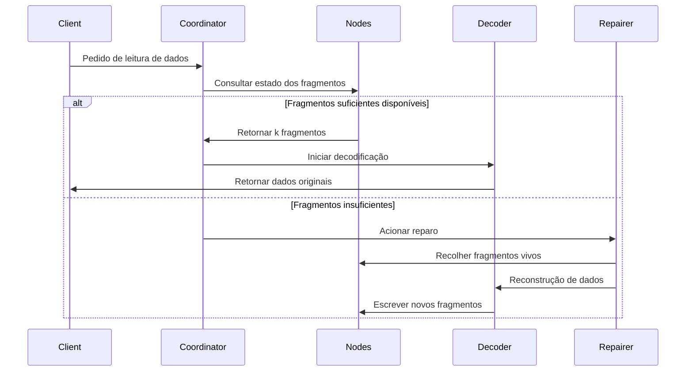

# Princípios do Erasure Coding

## 1. Algoritmo central e cenários de aplicação

O código de Reed‑Solomon (RS) é um tipo de Erasure Code baseado em campos finitos, conhecido pela alta capacidade de recuperação de dados e pela flexibilidade de configuração de redundância. É amplamente usado em:

### 1.1. Armazenamento distribuído (ex.: RustFS)
- **Fragmentação de dados e redundância**
  Divide‑se o dado original em `k` fragmentos e geram‑se `m` fragmentos de paridade (total `n = k + m`). É possível recuperar o dado se até `m` fragmentos forem perdidos.
  **Exemplo**: uma política RS(10,4) tolera perda simultânea de 4 nós (utilização 71%), economizando ~50% de espaço em relação a três réplicas (33%).

- **Recuperação de falhas**
  Recostrução por eliminação gaussiana ou FFT a partir dos fragmentos sobreviventes; o tempo de recuperação é inversamente proporcional à largura de banda.

- **Ajuste dinâmico**
  Suporta ajustar `(k,m)` em runtime para adequar níveis de confiabilidade (dados quentes/mornos/frios).

### 1.2. Comunicação
- **Comunicação via satélite**
  RS(255,223) em cenários de alto atraso e alto BER (ex.: NASA), com capacidade de correção de 16 bytes por codeword.

- **Padrão 5G NR**
  RS combinado com CRC em canais de controle para transmissão confiável.

- **Redes de sensores sem fio**
  RS(6,2) para mitigar perdas acumuladas em múltiplos saltos, tolerando ~33% de perda.

### 1.3. Armazenamento de mídia digital
- **QR Code**
  Níveis de tolerância a erros (L 7%, M 15%, Q 25%, H 30%), permitindo decodificação mesmo com danos parciais.

- **Blu‑ray**
  Combina RS(248,216) com entrelaçamento cruzado para corrigir erros em rajada.

- **Armazenamento em DNA**
  RS em cadeias sintéticas para resistir a erros de síntese/sequenciamento (ex.: RS(4,2) em pesquisas da Microsoft).

## 2. Conceitos básicos de EC

### 2.1 Evolução da redundância de armazenamento
```rust
// Armazenamento tradicional com três réplicas
let data = "object_content";
let replicas = vec![data.clone(), data.clone(), data.clone()];
```
A abordagem multi‑réplica tem baixa eficiência (33%). EC divide e adiciona paridade para equilibrar eficiência e confiabilidade.

### 2.2 Parâmetros
- **k**: número de fragmentos de dados
- **m**: número de fragmentos de paridade
- **n**: total de fragmentos (n = k + m)
- **limiar de recuperação**: quaisquer k fragmentos recuperam o dado

| Esquema | Redundância | Tolerância a falhas |
|--------|-------------|---------------------|
| 3 réplicas | 200% | 2 nós |
| RS(10,4) | 40% | 4 nós |

## 3. Fundamentos matemáticos de RS

### 3.1 Construção do campo finito (Galois Field)
Usa‑se GF(2^8) com 256 elementos, satisfazendo:
```math
α^8 + α^4 + α^3 + α^2 + 1 = 0
```
Polinómio gerador `0x11D` (binário `100011101`).

### 3.2 Matriz de codificação
Matriz de Vandermonde (k=2, m=2):
```math
G = \begin{bmatrix}
1 & 0 \\
0 & 1 \\
1 & 1 \\
1 & 2
\end{bmatrix}
```

### 3.3 Processo de codificação
Vetor de dados D = [d₁, d₂, ..., d_k]
Resultado C = D × G

Interpolação pelo polinómio gerador:
```math
p(x) = d_1 + d_2x + ... + d_kx^{k-1}
```
Cálculo dos valores de paridade:
```math
c_i = p(i), \quad i = k+1,...,n
```

## 4. Implementação no RustFS

### 4.1 Estratégia de fragmentação
```rust
struct Shard {
 index: u8,
 data: Vec<u8>,
 hash: [u8; 32],
}

fn split_data(data: &[u8], k: usize) -> Vec<Shard> {
 // Implementação da lógica de fragmentação
}
```
- Tamanho de fragmento dinâmico (64 KB‑4 MB)
- Hash Blake3 para verificação

### 4.2 Otimizações de codificação paralela
```rust
use rayon::prelude::*;

fn rs_encode(data: &[Shard], m: usize) -> Vec<Shard> {
 data.par_chunks(k).map(|chunk| {
 // Multiplicação matricial acelerada com SIMD
 unsafe { gf256_simd::rs_matrix_mul(chunk, &gen_matrix) }
 }).collect()
}
```
- Paralelismo com Rayon
- Operações no campo finito otimizadas com AVX2

### 4.3 Fluxo de recuperação (decoding)



