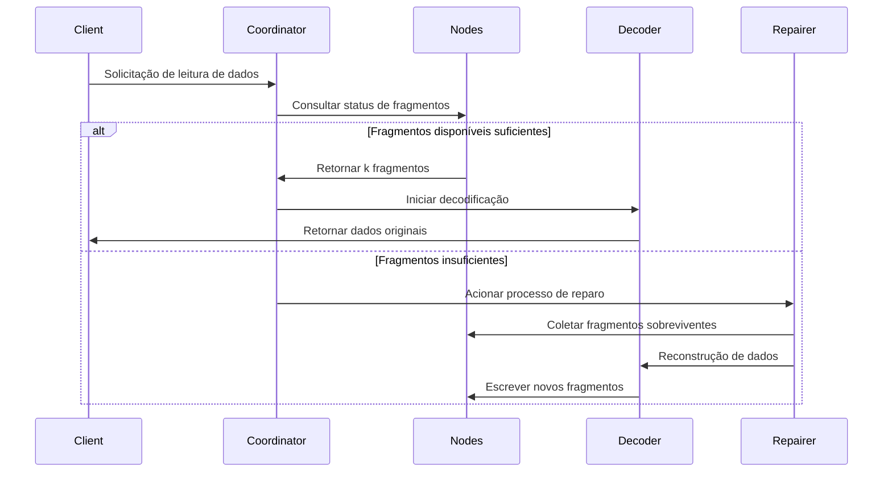

# Princípios do Código de Apagamento

## 1. Algoritmo Central e Escopo de Aplicação

O Código Reed-Solomon (RS) é um tipo de código de apagamento (Erasure Code) baseado na estrutura algébrica de campos finitos. Devido à sua **capacidade eficiente de recuperação de dados** e **configuração flexível de redundância**, é amplamente aplicado em múltiplas áreas. A seguir, explicamos detalhadamente seus cenários de aplicação central das perspectivas técnicas e de aplicações práticas:

### 1.1. Sistemas de Armazenamento Distribuído (como RustFS)
- **Fragmentação e Redundância de Dados**
  Divide dados originais em `k` fragmentos, gera `m` fragmentos de verificação (total `n=k+m`). A perda de qualquer ≤ `m` fragmentos pode ser recuperada.
  **Exemplo**: Estratégia RS(10,4) permite perda simultânea de 4 nós (taxa de utilização de armazenamento 71%), economizando 50% de espaço de armazenamento em comparação com três réplicas (33%).

- **Mecanismo de Recuperação de Falhas**
  Através do **método de eliminação gaussiana** ou algoritmo de **Transformada Rápida de Fourier (FFT)**, utiliza fragmentos sobreviventes para reconstruir dados perdidos. O tempo de recuperação é inversamente proporcional à largura de banda da rede.

- **Capacidade de Ajuste Dinâmico**
  Suporta ajuste de parâmetros `(k,m)` em tempo de execução, adaptando-se às necessidades de confiabilidade de diferentes níveis de armazenamento (dados quentes/mornos/frios).

### 1.2. Transmissão de Comunicação
- **Comunicação por Satélite**
  Lida com problemas de alta latência e alta taxa de erro em canais de espaço profundo (ex: sondas marcianas da NASA usam código RS(255,223), capacidade de correção de erro de 16 bytes/palavra-código).

- **Padrão 5G NR**
  Usa código RS combinado com verificação CRC em canais de controle, garantindo transmissão confiável de sinalização crítica.

- **Redes de Sensores Wireless**
  Resolve problemas de perda cumulativa de pacotes em transmissão multi-hop. Configuração típica RS(6,2) pode tolerar 33% de perda de dados.

### 1.3. Armazenamento de Mídia Digital
- **Código QR**
  Usa código RS para ajuste de níveis de tolerância a erros (L7%, M15%, Q25%, H30%), permitindo decodificação correta mesmo com áreas parcialmente danificadas.

- **Discos Blu-ray**
  Adota combinação de código RS(248,216) com intercalação cruzada, corrigindo erros de explosão contínua causados por arranhões.

- **Armazenamento de Dados em DNA**
  Adiciona verificação RS durante síntese de cadeias biomoleculares, resistindo a erros de síntese/sequenciamento de bases (ex: projeto experimental da Microsoft usa RS(4,2)).

## 2. Conceitos Básicos do Código de Apagamento

### 2.1 Evolução da Redundância de Armazenamento
```rust
// Armazenamento tradicional de três réplicas
let data = "object_content";
let replicas = vec![data.clone(), data.clone(), data.clone()];
```
Esquemas tradicionais de múltiplas réplicas têm problema de baixa eficiência de armazenamento (taxa de utilização 33%). A tecnologia de código de apagamento divide dados e calcula informações de verificação, equilibrando eficiência de armazenamento com confiabilidade.

### 2.2 Definição de Parâmetros Centrais
- **k**: Número de fragmentos de dados originais
- **m**: Número de fragmentos de verificação
- **n**: Número total de fragmentos (n = k + m)
- **Limiar de Recuperação**: Qualquer k fragmentos podem recuperar dados originais

| Tipo de Esquema | Redundância | Tolerância a Falhas |
|------------|----------|------------|
| 3 réplicas | 200% | 2 nós |
| RS(10,4) | 40% | 4 nós |

## 3. Princípios Matemáticos do Código Reed-Solomon

### 3.1 Construção de Campo Finito (Campo de Galois)
Usa campo GF(2^8) (256 elementos), satisfazendo:
```math
α^8 + α^4 + α^3 + α^2 + 1 = 0
```
Polinômio gerador é `0x11D`, correspondendo ao binário `100011101`

### 3.2 Construção de Matriz de Codificação
Exemplo de matriz de Vandermonde (k=2, m=2):
```math
G = \begin{bmatrix}
1 & 0 \\
0 & 1 \\
1 & 1 \\
1 & 2
\end{bmatrix}
```

### 3.3 Processo de Codificação
Vetor de dados D = [d₁, d₂,..., dk]
Resultado de codificação C = D × G

**Método de interpolação de polinômio gerador**:
Constrói polinômio passando por k pontos de dados:
```math
p(x) = d_1 + d_2x + ... + d_kx^{k-1}
```
Cálculo de valores de verificação:
```math
c_i = p(i), \quad i = k+1,...,n
```

## 4. Implementação de Engenharia no RustFS

### 4.1 Estratégia de Fragmentação de Dados
```rust
struct Shard {
    index: u8,
    data: Vec<u8>,
    hash: [u8; 32],
}

fn split_data(data: &[u8], k: usize) -> Vec<Shard> {
    // Implementação de lógica de fragmentação
}
```
- Ajuste dinâmico de tamanho de fragmento (64 KB-4 MB)
- Valores de verificação hash usando algoritmo Blake3

### 4.2 Otimização de Codificação Paralela
```rust
use rayon::prelude::*;

fn rs_encode(data: &[Shard], m: usize) -> Vec<Shard> {
    data.par_chunks(k).map(|chunk| {
        // Operação matricial acelerada por SIMD
        unsafe { gf256_simd::rs_matrix_mul(chunk, &gen_matrix) }
    }).collect()
}
```
- Framework de computação paralela baseado em Rayon
- Otimização de operações de campo finito usando conjunto de instruções AVX2

### 4.3 Fluxo de Recuperação de Decodificação

