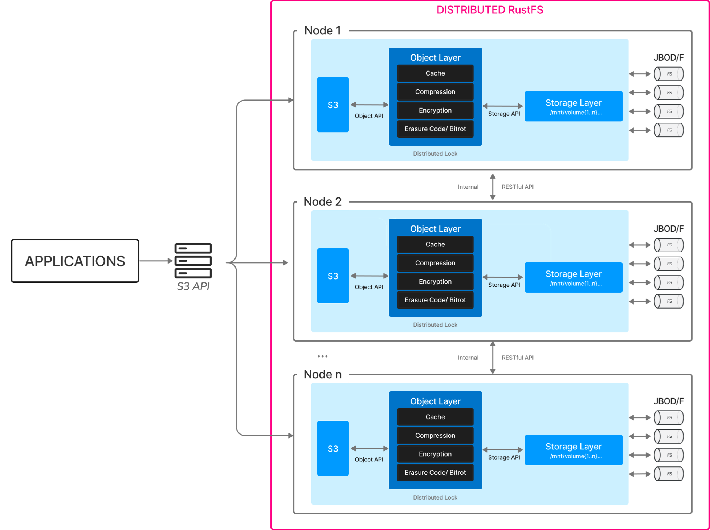

# Объяснение доступности и масштабируемости

## Обзор плана расширения

RustFS поддерживает горизонтальное масштабирование путем добавления новых пулов хранения (Server Pool). Каждый добавляемый новый пул хранения должен удовлетворять:

1. Узлы в пуле хранения должны использовать **последовательные имена хостов** (например, node5-node8)
2. Один пул хранения должен использовать диски **одинаковой спецификации** (тип/емкость/количество)
3. Новый пул хранения должен поддерживать **синхронизацию времени** и **сетевую связность** с существующим кластером



---

## I. Подготовка перед расширением

### 1.1 Требования к планированию оборудования

| Элемент | Минимальное требование | Рекомендуемая производственная конфигурация |
|---------------|---------------------------|---------------------------|
| Количество узлов | 4 узла/пул хранения | 4 - 8 узлов/пул хранения |
| Память на узел | 128 ГБ | 128 ГБ |
| Тип диска | SSD | NVMe SSD |
| Емкость на диск | ≥1 ТБ | ≥4 ТБ |
| Пропускная способность сети | 10 Гбит/с | 25 Гбит/с |

### 1.2 Проверка системной среды

```bash
# Проверить непрерывность имен хостов (пример новых узлов)
cat /etc/hosts
192.168.10.5 node5
192.168.10.6 node6
192.168.10.7 node7
192.168.10.8 node8

# Проверить статус синхронизации времени
timedatectl status | grep synchronized

# Проверить правила брандмауэра (все узлы должны открыть порты 7000/7001)
firewall-cmd --list-ports | grep 7000
```

---

## II. Шаги реализации расширения

### 2.1 Базовая конфигурация новых узлов

```bash
# Создать выделенного пользователя (выполнить на всех новых узлах)
groupadd rustfs-user
useradd -M -r -g rustfs-user rustfs-user

# Создать каталог хранения (пример с 8 дисками)
mkdir -p /data/rustfs{0..7}
chown -R rustfs-user:rustfs-user /data/rustfs*
```

### 2.2 Установка сервиса RustFS

```bash
# Скачать последний бинарный пакет (версия должна совпадать с существующим кластером)
wget https://dl.rustfs.com/rustfs/v2.3.0/rustfs -O /usr/local/bin/rustfs
chmod +x /usr/local/bin/rustfs

# Создать файл конфигурации (/etc/default/rustfs)
cat <<EOF > /etc/default/rustfs
RUSTFS_ROOT_USER=admin
RUSTFS_ROOT_PASSWORD=YourSecurePassword
RUSTFS_VOLUMES="/data/rustfs{0...7}"
RUSTFS_ADDRESS=":7000"
RUSTFS_CONSOLE_ADDRESS=":7001"
EOF
```

### 2.3 Операция расширения кластера

```bash
# Обновить конфигурацию на всех существующих узлах (добавить новый пул хранения)
sed -i '/RUSTFS_VOLUMES/s|"$| http://node{5...8}:7000/data/rustfs{0...7}"|' /etc/default/rustfs

# Глобальный перезапуск сервиса (выполнить одновременно на всех узлах)
systemctl restart rustfs.service
```

---

## III. Проверка после расширения

### 3.1 Проверка состояния кластера

```bash
# Проверить статус присоединения узлов
curl -s http://node1:7001/cluster/nodes | jq .poolMembers

# Проверить распределение пулов хранения
rc admin info cluster
```

### 3.2 Проверка балансировки данных

```bash
# Просмотреть соотношение распределения данных (должно быть близко к соотношению емкости каждого пула хранения)
watch -n 5 "rustfs-admin metrics | grep 'PoolUsagePercent'"
```

---

## IV. Моменты внимания

1. **Каскадный перезапуск запрещен**: Все узлы должны быть перезапущены одновременно, чтобы избежать несогласованности данных
2. **Рекомендация по планированию емкости**: Планировать следующее расширение до того, как использование хранилища достигнет 70%
3. **Рекомендации по оптимизации производительности**:

```bash
# Настроить параметры ядра (все узлы)
echo "vm.swappiness=10" >> /etc/sysctl.conf
echo "net.core.somaxconn=32768" >> /etc/sysctl.conf
sysctl -p
```

---

## V. Руководство по устранению неполадок

| Явление | Точка проверки | Команда восстановления |
|---------------------------|---------------------------------|-------------------------------|
| Новый узел не может присоединиться к кластеру | Проверить связность порта 7000 | `telnet node5 7000` |
| Несбалансированное распределение данных | Проверить конфигурацию емкости пула хранения | `rustfs-admin rebalance start`|
| Консоль показывает аномальное состояние узла | Проверить статус синхронизации времени | `chronyc sources` |

> Совет: Данный документ написан на основе последней версии RustFS. Пожалуйста, выполните полное резервное копирование данных перед операциями расширения. Для производственной среды рекомендуется связаться с инженерами технической поддержки RustFS для оценки плана.

