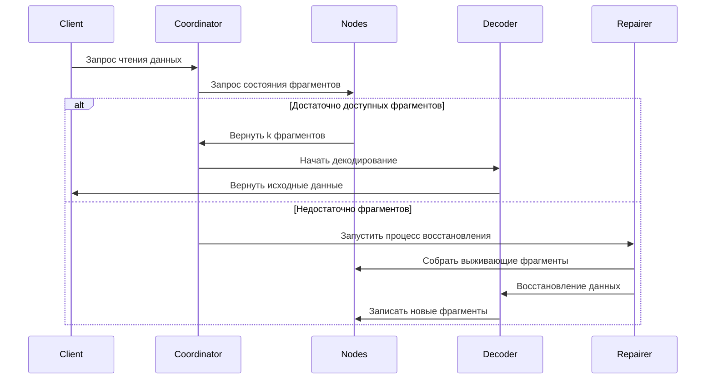

# Принцип кодирования стирания

## I. Центральный алгоритм и область применения центрального алгоритма

Код Рида-Соломона (Reed-Solomon Code, RS код) - это код стирания (Erasure Code), основанный на алгебраической структуре конечных полей. Благодаря своей **эффективной способности восстановления данных** и **гибкой конфигурации избыточности**, он широко применяется в различных областях. Ниже подробно объясняются его основные сценарии применения с двух измерений: технические области и практические применения:

### 1.1. Системы распределенного хранения (например, RustFS)
- **Фрагментация данных и избыточность**
  Разделить исходные данные на `k` фрагментов, сгенерировать `m` проверочных фрагментов (всего `n=k+m`). Любая потеря ≤ `m` фрагментов может восстановить данные.
  **Пример**: Стратегия RS(10,4) позволяет одновременную потерю 4 узлов (коэффициент использования хранилища 71%), экономя 50% пространства хранения по сравнению с тремя репликами (33%).

- **Механизм восстановления после сбоев**
  С помощью **алгоритма исключения Гаусса** или **алгоритма быстрого преобразования Фурье (FFT)**, использовать выживающие фрагменты для восстановления потерянных данных, время восстановления обратно пропорционально пропускной способности сети.

- **Способность динамической настройки**
  Поддерживает настройку параметров `(k,m)` во время выполнения, адаптируясь к требованиям надежности различных уровней хранения (горячие/теплые/холодные данные).

### 1.2. Передача связи
- **Спутниковая связь**
  Обработка проблем длительной задержки и высокого уровня ошибок в каналах дальнего космоса (например, марсоход NASA использует код RS(255,223), способность исправления ошибок достигает 16 байт/кодовое слово).

- **Стандарт 5G NR**
  Принимает код RS в сочетании с проверкой CRC в канале управления, обеспечивая надежную передачу критической сигнализации.

- **Беспроводная сенсорная сеть**
  Решает проблемы накопительных потерь пакетов в многошаговой передаче, типичная конфигурация RS(6,2) может терпеть 33% потерю данных.

### 1.3. Хранение цифровых медиа
- **QR-код**
  Использует код RS для реализации регулировки уровня устойчивости к ошибкам (L7%, M15%, Q25%, H30%), даже при повреждении некоторых областей можно правильно декодировать.

- **Диск Blu-ray**
  Принимает комбинацию кода RS(248,216) с перекрестным чередованием, исправляя непрерывные пакетные ошибки, вызванные царапинами.

- **Хранение данных ДНК**
  Добавляет проверку RS при синтезе цепочек биомолекул, сопротивляясь ошибкам синтеза/секвенирования оснований (например, экспериментальный проект Microsoft использует RS(4,2)).

## II. Основные концепции кодирования стирания

### 2.1 Эволюция избыточности хранения
```rust
// Традиционное хранение с тремя репликами
let data = "object_content";
let replicas = vec![data.clone(), data.clone(), data.clone()];
```
Традиционные решения с несколькими репликами имеют проблему низкой эффективности хранения (коэффициент использования хранилища 33%). Технология кодирования стирания разделяет данные на блоки, а затем вычисляет проверочную информацию, достигая баланса между эффективностью хранения и надежностью.

### 2.2 Определение центральных параметров
- **k**: Количество фрагментов исходных данных
- **m**: Количество проверочных фрагментов
- **n**: Общее количество фрагментов (n = k + m)
- **Порог восстановления**: Любые k фрагментов могут восстановить исходные данные

| Тип решения | Избыточность | Устойчивость к отказам |
|------------|----------|------------|
| 3 реплики | 200% | 2 узла |
| RS(10,4) | 40% | 4 узла |

## III. Математический принцип кода Рида-Соломона

### 3.1 Построение конечного поля (Galois Field)
Принимает поле GF(2^8) (256 элементов), удовлетворяющее:
```math
α^8 + α^4 + α^3 + α^2 + 1 = 0
```
Порождающий полином `0x11D`, соответствующий двоичному `100011101`

### 3.2 Построение матрицы кодирования
Пример матрицы Вандермонда (k=2, m=2):
```math
G = \begin{bmatrix}
1 & 0 \\
0 & 1 \\
1 & 1 \\
1 & 2
\end{bmatrix}
```

### 3.3 Процесс кодирования
Вектор данных D = [d₁, d₂,..., dk]
Результат кодирования C = D × G

**Метод интерполяции порождающего полинома**:
Построить полином, проходящий через k точек данных:
```math
p(x) = d_1 + d_2x + ... + d_kx^{k-1}
```
Вычисление проверочного значения:
```math
c_i = p(i), \quad i = k+1,...,n
```

## IV. Инженерная реализация в RustFS

### 4.1 Стратегия фрагментации данных
```rust
struct Shard {
    index: u8,
    data: Vec<u8>,
    hash: [u8; 32],
}

fn split_data(data: &[u8], k: usize) -> Vec<Shard> {
    // Реализация логики фрагментации
}
```
- Динамическая настройка размера фрагмента (64 КБ-4 МБ)
- Хеш-значение проверки с использованием алгоритма Blake3

### 4.2 Оптимизация параллельного кодирования
```rust
use rayon::prelude::*;

fn rs_encode(data: &[Shard], m: usize) -> Vec<Shard> {
    data.par_chunks(k).map(|chunk| {
        // SIMD-ускоренная матричная операция
        unsafe { gf256_simd::rs_matrix_mul(chunk, &gen_matrix) }
    }).collect()
}
```
- Фреймворк параллельных вычислений на основе Rayon
- Использует набор инструкций AVX2 для оптимизации операций конечного поля

### 4.3 Поток восстановления декодирования


