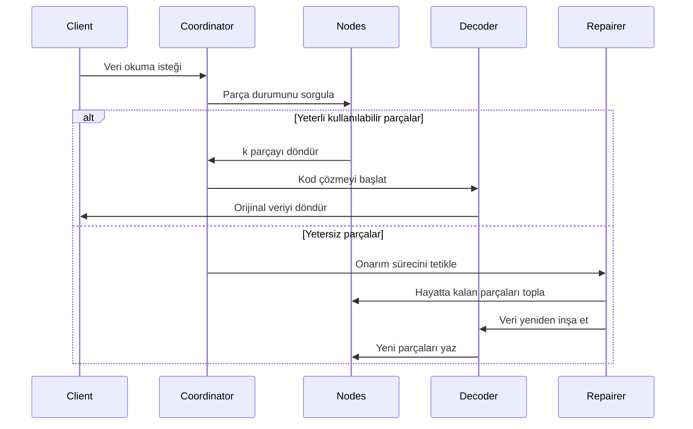

# Silme Kodlama İlkeleri

## 1. Temel Algoritmalar ve Uygulama Kapsamı

Reed-Solomon Kodu (RS Kodu), sonlu alan cebirsel yapılarına dayanan bir silme kodudur. **Verimli veri kurtarma yetenekleri** ve **esnek yedeklilik yapılandırması** nedeniyle, birçok alanda geniş bir uygulama alanına sahiptir. Aşağıda teknik alanlar ve pratik uygulamalardan temel uygulama senaryoları detaylandırılmıştır:

### 1.1. Dağıtık Depolama Sistemleri (örneğin RustFS)

- **Veri Parçalama ve Yedeklilik**
  Orijinal veriyi `k` parçaya bölün ve `m` parite parçası oluşturun (toplam `n=k+m`). ≤ `m` parça kaybından veri kurtarılabilir.
  **Örnek**: RS(10,4) stratejisi, aynı anda 4 düğüm kaybına izin verir (%71 depolama kullanımı), üç kopyaya göre %50 depolama alanı tasarrufu sağlar (%33).

- **Arıza Kurtarma Mekanizması**
  **Gaussian eliminasyonu** veya **Hızlı Fourier Dönüşümü (FFT)** algoritmaları aracılığıyla hayatta kalan parçaları kullanarak kaybolan verileri yeniden oluşturun, kurtarma süresi ağ bant genişliği ile ters orantılıdır.

- **Dinamik Ayarlama Kabiliyeti**
  Çalışma zamanı `(k,m)` parametrelerinin ayarlanmasını destekler, farklı depolama katmanlarının (sıcak/ılık/soğuk veri) güvenilirlik gereksinimlerine uyum sağlar.

### 1.2. İletişim İletimi

- **Uydu İletişimi**
  Derin uzay kanallarındaki uzun gecikme ve yüksek bit hata oranı sorunlarını ele alır (örneğin, NASA Mars gezgini RS(255,223) kodunu kullanır, kod sözcüğü başına 16 bayt hata düzeltme kabiliyetine sahiptir).

- **5G NR Standardı**
  Kontrol kanallarında RS kodlarını CRC checksum'ları ile birleştirerek kritik sinyallemenin güvenilir iletimini sağlar.

- **Kablosuz Sensör Ağları**
  Çoklu atlamalı iletimdeki birikimli paket kaybını çözer, tipik RS(6,2) yapılandırması %33 veri kaybına tolerans gösterir.

### 1.3. Dijital Medya Depolama

- **QR Kodları**
  Hata düzeltme seviyesi ayarlaması için RS kodlarını kullanır (L%7, M%15, Q%25, H%30), kısmi alan hasarıyla bile doğru çözümlemeyi sağlar.

- **Blu-ray Diskler**
  Çiziklerden kaynaklanan sürekli patlama hatalarını düzeltmek için çapraz iç içe geçme ile RS(248,216) kodunu kullanır.

- **DNA Veri Depolama**
  Biyolojik moleküler zincirlerin sentezlenmesi sırasında RS doğrulaması ekler, baz sentezleme/dizileme hatalarına karşı direnç gösterir (örneğin, Microsoft deneysel projesi RS(4,2) kullanır).

## 2. Silme Kodlama Temel Kavramları

### 2.1. Depolama Yedekliliğinin Evrimi

```rust
// Geleneksel üç kopyalı depolama
let data = "object_content";
let replicas = vec![data.clone(), data.clone(), data.clone()];
```

Geleneksel çoklu kopyalama şemaları düşük depolama verimliliği sorunlarına sahiptir (%33 depolama kullanımı). Silme kodlama teknolojisi, veri bloklamadan sonra doğrulama bilgilerini hesaplayarak depolama verimliliği ve güvenilirlik arasında bir denge sağlar.

### 2.2. Temel Parametre Tanımları

- **k**: Orijinal veri parçalarının sayısı
- **m**: Parite parçalarının sayısı
- **n**: Toplam parça sayısı (n = k + m)
- **Kurtarma Eşiği**: Herhangi k parça orijinal veriyi kurtarabilir

| Şema Türü | Yedeklilik | Hata Toleransı |
|------------|------------|----------------|
| 3 Kopyası | %200 | 2 düğüm |
| RS(10,4) | %40 | 4 düğüm |

## 3. Reed-Solomon Kod Matematiksel İlkeleri

### 3.1. Sonlu Alan (Galois Alanı) Yapısı

GF(2^8) alanını kullanır (256 eleman), şu koşulu sağlar:

```math
α^8 + α^4 + α^3 + α^2 + 1 = 0
```

Üreteç polinomu `0x11D`dir, ikili olarak `100011101` karşılık gelir.

### 3.2. Kodlama Matrisi Yapısı

Vandermonde matris örneği (k=2, m=2):

```math
G = \begin{bmatrix}
1 & 0 \\
0 & 1 \\
1 & 1 \\
1 & 2
\end{bmatrix}
```

### 3.3. Kodlama Süreci

Veri vektörü D = [d₁, d₂,..., dk]

Kodlama sonucu C = D × G

**Üreteç Polinom Enterpolasyon Yöntemi**:

k veri noktasından geçen polinom oluşturun:

```math
p(x) = d_1 + d_2x + ... + d_kx^{k-1}
```

Parite değer hesaplaması:

```math
c_i = p(i), \quad i = k+1,...,n
```

## 4. RustFS'de Mühendislik Uygulaması

### 4.1. Veri Parçalama Stratejisi

```rust
struct Shard {
    index: u8,
    data: Vec<u8>,
    hash: [u8; 32],
}

fn split_data(data: &[u8], k: usize) -> Vec<Shard> {
    // Parçalama mantığı uygulama
}
```

- Dinamik parça boyutu ayarlama (64 KB-4 MB)
- Blake3 algoritması kullanılarak hash doğrulama değerleri

### 4.2. Paralel Kodlama Optimizasyonu

```rust
use rayon::prelude::*;

fn rs_encode(data: &[Shard], m: usize) -> Vec<Shard> {
    data.par_chunks(k).map(|chunk| {
        // SIMD-hızlandırılmış matris işlemleri
        unsafe { gf256_simd::rs_matrix_mul(chunk, &gen_matrix) }
    }).collect()
}
```

- Rayon tabanlı paralel hesaplama çerçevesi
- Sonlu alan işlemleri için AVX2 komut seti optimizasyonu

### 4.3. Kod Çözme Kurtarma Süreci



## 5. Performans Optimizasyonu

### 5.1. Hesaplama Karmaşıklığı

- **Kodlama**: O(k×m) sonlu alan çarpımları
- **Kod Çözme**: O(k³) Gaussian eliminasyon karmaşıklığı
- **Bellek Kullanımı**: Üreteç matrisi depolama için O(k²)

### 5.2. Donanım Hızlandırma

- **Intel ISA-L Kütüphanesi**: Optimize edilmiş assembly uygulaması
- **GPU Hızlandırma**: CUDA tabanlı paralel matris işlemleri
- **FPGA Uygulaması**: Yüksek verimli senaryolar için özel donanım

### 5.3. Ağ Optimizasyonu

- **Kısmi Yeniden Yapılandırma**: Sadece gerekli veri kısımlarını kod çöz
- **Tembel Onarım**: Kurtarma eşiğine ulaşana kadar yeniden yapılandırmayı ertele
- **Bant Genişliği Dengesi**: Yeniden yapılandırma yükünü düğümler arasında dağıt

## 6. Güvenilirlik Analizi

### 6.1. Arıza Olasılığı Modelleme

RS(k,m) şeması için düğüm arıza oranı λ:

```math
MTTF = \frac{1}{\lambda} \times \frac{1}{\binom{n}{m+1}} \times \sum_{i=0}^{m} \binom{n}{i}
```

### 6.2. Gerçek Dünya Dayanıklılığı

- **RS(10,4)**: Yıllık %99.999999999 (11 dokuz) dayanıklılık
- **RS(14,4)**: Yıllık %99.9999999999 (12 oniki) dayanıklılık
- **Karşılaştırma**: 3 kopyası ~%99.9999 (6 dokuz) dayanıklılık sağlar

## 7. En İyi Uygulamalar

### 7.1. Parametre Seçim Kılavuzu

| Veri Türü | Erişim Modeli | Önerilen RS | Gerekçe |
|-----------|---------------|-------------|---------|
| Sıcak Veri | Yüksek IOPS | RS(6,2) | Hızlı kurtarma |
| Ilık Veri | Orta Erişim | RS(10,4) | Dengeli verimlilik |
| Soğuk Veri | Arşiv | RS(14,4) | Maksimum verimlilik |

### 7.2. İşletimsel Hususlar

- **Onarım Hızı**: Yeniden yapılandırma bant genişliğini izleyin ve optimize edin
- **Temizleme**: Arka plan doğrulaması kullanarak düzenli bütünlük kontrolleri
- **Yükseltmeler**: Çevrimiçi parametre yeniden yapılandırmasını destekleyin
- **İzleme**: Parça dağılımını ve arıza modellerini takip edin