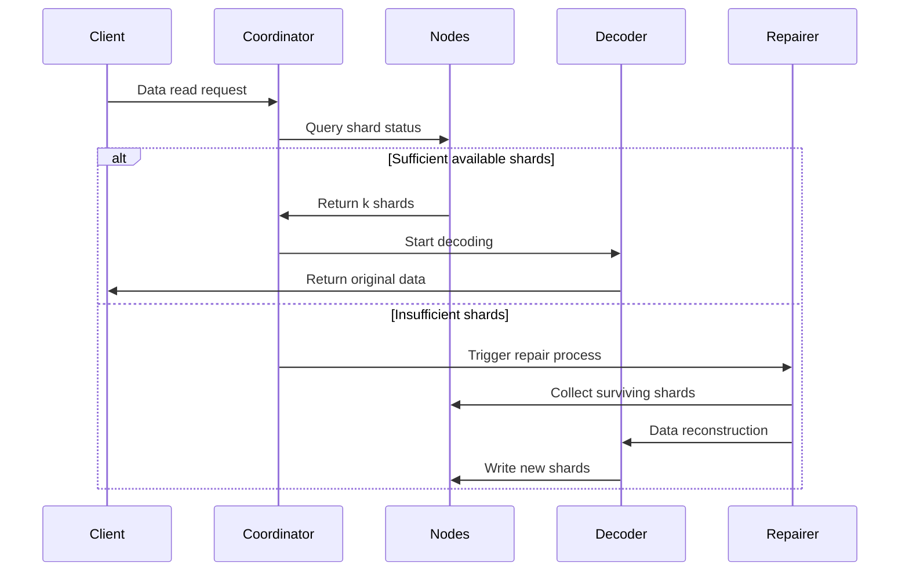

# Erasure Coding Principles

## 1. Core Algorithms and Application Scope

Reed-Solomon Code (RS Code) is an erasure code based on finite field algebraic structures. Due to its **efficient data recovery capabilities** and **flexible redundancy configuration**, it is widely applied across multiple domains. The following details its core application scenarios from both technical domains and practical applications:

### 1.1. Distributed Storage Systems (such as RustFS)

- **Data Sharding and Redundancy**
  Divide original data into `k` shards and generate `m` parity shards (total `n=k+m`). Data can be recovered from any loss of ≤ `m` shards.
  **Example**: RS(10,4) strategy allows simultaneous loss of 4 nodes (71% storage utilization), saving 50% storage space compared to three replicas (33%).

- **Failure Recovery Mechanism**
  Through **Gaussian elimination** or **Fast Fourier Transform (FFT)** algorithms, use surviving shards to rebuild lost data, with recovery time inversely proportional to network bandwidth.

- **Dynamic Adjustment Capability**
  Supports runtime adjustment of `(k,m)` parameters to adapt to different storage tiers' (hot/warm/cold data) reliability requirements.

### 1.2. Communication Transmission

- **Satellite Communication**
  Handles long delay and high bit error rate issues in deep space channels (e.g., NASA Mars rover uses RS(255,223) code with 16-byte/codeword error correction capability).

- **5G NR Standard**
  Uses RS codes combined with CRC checksums in control channels to ensure reliable transmission of critical signaling.

- **Wireless Sensor Networks**
  Solves cumulative packet loss in multi-hop transmission, with typical RS(6,2) configuration tolerating 33% data loss.

### 1.3. Digital Media Storage

- **QR Codes**
  Uses RS codes for error correction level adjustment (L7%, M15%, Q25%, H30%), enabling correct decoding even with partial area damage.

- **Blu-ray Discs**
  Employs RS(248,216) code with cross-interleaving to correct continuous burst errors caused by scratches.

- **DNA Data Storage**
  Adds RS verification when synthesizing biological molecular chains to resist base synthesis/sequencing errors (e.g., Microsoft experimental project uses RS(4,2)).

## 2. Erasure Coding Basic Concepts

### 2.1 Evolution of Storage Redundancy

```rust
// Traditional three-replica storage
let data = "object_content";
let replicas = vec![data.clone(), data.clone(), data.clone()];
```

Traditional multi-replica schemes have low storage efficiency issues (33% storage utilization). Erasure coding technology calculates verification information after data blocking, achieving a balance between storage efficiency and reliability.

### 2.2 Core Parameter Definitions

- **k**: Number of original data shards
- **m**: Number of parity shards
- **n**: Total number of shards (n = k + m)
- **Recovery Threshold**: Any k shards can recover original data

| Scheme Type | Redundancy | Fault Tolerance |
|------------|----------|------------|
| 3 Replicas | 200% | 2 nodes |
| RS(10,4) | 40% | 4 nodes |

## 3. Reed-Solomon Code Mathematical Principles

### 3.1 Finite Field (Galois Field) Construction

Uses GF(2^8) field (256 elements), satisfying:

```math
α^8 + α^4 + α^3 + α^2 + 1 = 0
```

Generator polynomial is `0x11D`, corresponding to binary `100011101`

### 3.2 Encoding Matrix Construction

Vandermonde matrix example (k=2, m=2):

```math
G = \begin{bmatrix}
1 & 0 \\
0 & 1 \\
1 & 1 \\
1 & 2
\end{bmatrix}
```

### 3.3 Encoding Process

Data vector D = [d₁, d₂,..., dk]
Encoding result C = D × G

**Generator Polynomial Interpolation Method**:
Construct polynomial passing through k data points:

```math
p(x) = d_1 + d_2x + ... + d_kx^{k-1}
```

Parity value calculation:

```math
c_i = p(i), \quad i = k+1,...,n
```

## 4. Engineering Implementation in RustFS

### 4.1 Data Sharding Strategy

```rust
struct Shard {
    index: u8,
    data: Vec<u8>,
    hash: [u8; 32],
}

fn split_data(data: &[u8], k: usize) -> Vec<Shard> {
    // Sharding logic implementation
}
```

- Dynamic shard size adjustment (64 KB-4 MB)
- Hash verification values using Blake3 algorithm

### 4.2 Parallel Encoding Optimization

```rust
use rayon::prelude::*;

fn rs_encode(data: &[Shard], m: usize) -> Vec<Shard> {
    data.par_chunks(k).map(|chunk| {
        // SIMD-accelerated matrix operations
        unsafe { gf256_simd::rs_matrix_mul(chunk, &gen_matrix) }
    }).collect()
}
```

- Parallel computing framework based on Rayon
- AVX2 instruction set optimization for finite field operations

### 4.3 Decoding Recovery Process



## 5. Performance Optimization

### 5.1 Computational Complexity

- **Encoding**: O(k×m) finite field multiplications
- **Decoding**: O(k³) Gaussian elimination complexity
- **Memory Usage**: O(k²) for generator matrix storage

### 5.2 Hardware Acceleration

- **Intel ISA-L Library**: Optimized assembly implementation
- **GPU Acceleration**: CUDA-based parallel matrix operations
- **FPGA Implementation**: Custom hardware for high-throughput scenarios

### 5.3 Network Optimization

- **Partial Reconstruction**: Only decode required data portions
- **Lazy Repair**: Delay reconstruction until reaching failure threshold
- **Bandwidth Balancing**: Distribute reconstruction load across nodes

## 6. Reliability Analysis

### 6.1 Failure Probability Modeling

For RS(k,m) scheme with node failure rate λ:

```math
MTTF = \frac{1}{\lambda} \times \frac{1}{\binom{n}{m+1}} \times \sum_{i=0}^{m} \binom{n}{i}
```

### 6.2 Real-world Durability

- **RS(10,4)**: 99.999999999% (11 nines) annual durability
- **RS(14,4)**: 99.9999999999% (12 nines) annual durability
- **Comparison**: 3-replica achieves ~99.9999% (6 nines)

## 7. Best Practices

### 7.1 Parameter Selection Guidelines

| Data Type | Access Pattern | Recommended RS | Rationale |
|-----------|---------------|----------------|-----------|
| Hot Data | High IOPS | RS(6,2) | Fast recovery |
| Warm Data | Medium Access | RS(10,4) | Balanced efficiency |
| Cold Data | Archive | RS(14,4) | Maximum efficiency |

### 7.2 Operational Considerations

- **Repair Speed**: Monitor and optimize reconstruction bandwidth
- **Scrubbing**: Regular integrity checks using background verification
- **Upgrades**: Support for online parameter reconfiguration
- **Monitoring**: Track shard distribution and failure patterns
