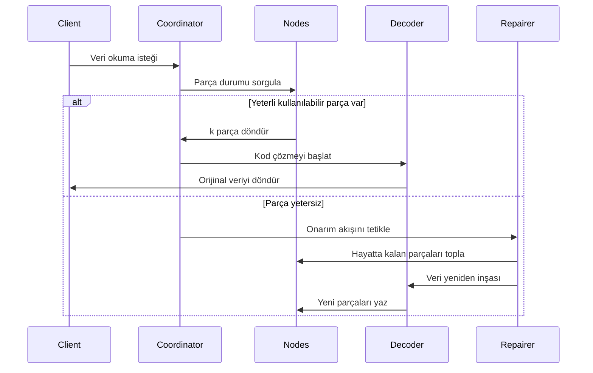

# Silme Kodlama Prensibi

## Bir. Çekirdek Algoritma ve Çekirdek Algoritma Uygulama Alanları

Reed-Solomon Kodu (Reed-Solomon Code, RS kodu) sonlu alan cebirsel yapısına dayalı bir silme kodudur (Erasure Code), **yüksek verimli veri kurtarma yeteneği** ve **esnek yedeklilik yapılandırması** nedeniyle birden çok alanda yaygın olarak uygulanmaktadır. Aşağıda teknik alanlar ve pratik uygulamalar olmak üzere iki boyuttan çekirdek uygulama senaryolarını detaylı olarak açıklıyoruz:

### 1.1. Dağıtık Depolama Sistemleri (RustFS gibi)
- **Veri Parçalama ve Yedeklilik**
 Orijinal veriyi `k` parçaya böler, `m` doğrulama parçası üretir (toplam `n=k+m`). Herhangi ≤ `m` parça kaybı verilerin kurtarılmasına olanak tanır.
 **Örnek**: RS(10,4) stratejisi 4 düğümün eş zamanlı kaybına izin verir (depolama kullanım oranı %71), üç kopya (%33) ile karşılaştırıldığında %50 depolama alanı tasarrufu sağlar.

- **Arıza Kurtarma Mekanizması**
 **Gauss eliminasyonu** veya **Hızlı Fourier Dönüşümü (FFT)** algoritması aracılığıyla, hayatta kalan parçaları kullanarak kayıp veriyi yeniden inşa eder, kurtarma zamanı ağ bant genişliği ile ters orantılıdır.

- **Dinamik Ayarlama Yeteneği**
 Çalışma zamanında `(k,m)` parametrelerinin ayarlanmasını destekler, farklı depolama katmanlarının (sıcak/ılık/soğuk veri) güvenilirlik gereksinimlerine uyum sağlar.

### 1.2. İletişim Aktarımı
- **Uydu İletişimi**
 Uzay kanalındaki uzun gecikme, yüksek hata oranı sorunlarını ele alır (NASA Mars keşif aracı RS(255,223) kodu kullanır, hata düzeltme kapasitesi 16 bayt/kod kelimesine ulaşır).

- **5G NR Standardı**
 Kontrol kanalında RS kodu ile CRC doğrulamasını birleştirir, kritik sinyalizasyonun güvenilir iletimini sağlar.

- **Kablosuz Sensör Ağları**
 Çok atlamalı iletimde kümülatif paket kaybı sorununu çözer, tipik yapılandırma RS(6,2) %33 veri kaybını tolere edebilir.

### 1.3. Dijital Medya Depolama
- **İki Boyutlu Kod (QR Code)**
 Hata toleransı seviyesi ayarlaması için RS kodu kullanır (L%7, M%15, Q%25, H%30), kısmi alanlar zarar görse bile doğru şekilde çözülebilir.

- **Blu-ray Disk**
 RS(248,216) kodu çapraz interleaving kombinasyonu benimser, çiziklerden kaynaklanan sürekli patlama hatalarını düzeltir.

- **DNA Veri Depolama**
 Sentetik biyomoleküler zincir oluştururken RS doğrulaması ekler, baz sentezi/sıralama hatalarına karşı direnç sağlar (Microsoft deneysel projesi RS(4,2) kullanır).


## İki. Silme Kodlama Temel Kavramları

### 2.1 Depolama Yedekliliğinin Evrimi
```rust
// Geleneksel üç kopya depolama
let data = "object_content";
let replicas = vec![data.clone(), data.clone(), data.clone()];
```
Geleneksel çoklu kopya çözümü depolama verimliliğinin düşük olması sorununu yaşar (depolama kullanım oranı %33). Silme kodlama teknolojisi veriyi parçaladıktan sonra doğrulama bilgisi hesaplar, depolama verimliliği ile güvenilirlik arasında denge kurar.

### 2.2 Çekirdek Parametre Tanımları
- **k**: Orijinal veri parça sayısı
- **m**: Doğrulama parça sayısı
- **n**: Toplam parça sayısı (n = k + m)
- **Kurtarma Eşiği**: Herhangi k parça orijinal veriyi kurtarabilir

| Çözüm Türü | Yedeklilik Oranı | Arıza Toleransı |
|------------|----------|------------|
| 3 kopya | %200 | 2 düğüm |
| RS(10,4) | %40 | 4 düğüm |

## Üç. Reed-Solomon Kodu Matematiksel Prensibi

### 3.1 Sonlu Alan (Galois Field) Oluşturumu
GF(2^8) alanı benimser (256 öğe), şunları karşılar:
```math
α^8 + α^4 + α^3 + α^2 + 1 = 0
```
Üretici eleman polinomu `0x11D`'dir, ikili sayı sisteminde `100011101`'e karşılık gelir

### 3.2 Kodlama Matrisi Oluşturumu
Vandermonde matrisi örneği (k=2, m=2):
```math
G = \begin{bmatrix}
1 & 0 \\
0 & 1 \\
1 & 1 \\
1 & 2
\end{bmatrix}
```


### 3.3 Kodlama Süreci
Veri vektörü D = [d₁, d₂,..., dk]
Kodlama sonucu C = D × G

**Üretici Polinom İnterpolasyon Yöntemi**:
k veri noktasından geçen polinom oluşturur:
```math
p(x) = d_1 + d_2x + ... + d_kx^{k-1}
```
Doğrulama değeri hesaplaması:
```math
c_i = p(i), \quad i = k+1,...,n
```

## Dört. RustFS'de Mühendislik Uygulaması

### 4.1 Veri Parçalama Stratejisi
```rust
struct Shard {
 index: u8,
 data: Vec<u8>,
 hash: [u8; 32],
}

fn split_data(data: &[u8], k: usize) -> Vec<Shard> {
 // Parçalama mantığı uygulaması
}
```
- Dinamik parça boyutu ayarlaması (64 KB-4 MB)
- Hash doğrulama değeri Blake3 algoritması kullanır

### 4.2 Paralel Kodlama Optimizasyonu
```rust
use rayon::prelude::*;

fn rs_encode(data: &[Shard], m: usize) -> Vec<Shard> {
 data.par_chunks(k).map(|chunk| {
 // SIMD hızlandırmalı matris işlemi
 unsafe { gf256_simd::rs_matrix_mul(chunk, &gen_matrix) }
 }).collect()
}
```
- Rayon tabanlı paralel hesaplama çerçevesi
- AVX2 komut seti kullanarak sonlu alan işlemlerini optimize eder

### 4.3 Kod Çözme Kurtarma Akışı


