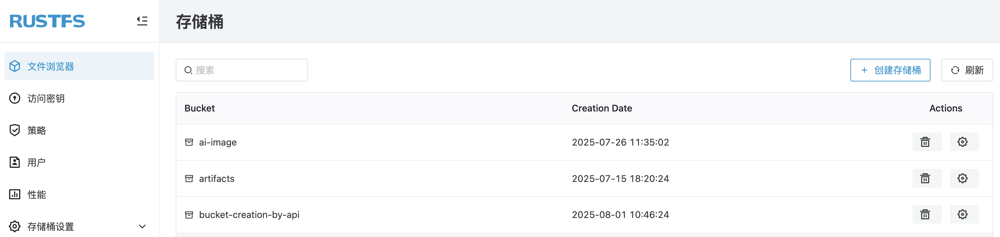
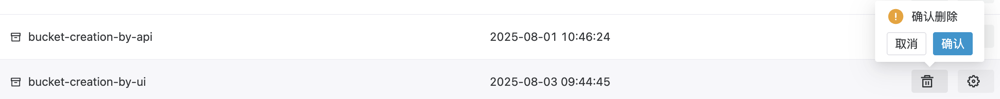

# RustFS 存储桶

存储桶（Bucket）是 RustFS 中用于组织和管理数据的基本容器。每个存储桶都具有唯一的名称，并且可以包含多个对象（Object）。存储桶提供了数据的逻辑分组，使得用户可以轻松地管理和访问数据。你可以通过 RustFS UI、`mc`（MinIO Client）或 API 来对存储桶进行操作（包括创建、删除、数据上传下载等）。

## 创建存储桶

前提条件：

- 一个可用的 RustFS 实例。可参考[安装指南](../../installation/index.md)进行安装。

## 在 RustFS UI 上创建存储桶

1. 登录 RustFS UI 控制台。
1. 在首页，左上角，选择 **创建存储桶**。
1. 输入存储桶名称，点击 **创建** 完成存储桶的创建。



### 使用 `mc` 创建存储桶

> 对于 `mc` 的安装和配置可以查看[`mc` 使用指南](../mc.md)章节。

使用 `mc mb` 命令创建存储桶：

```
# creat rustfs bucket
mc mb rustfs/bucket-creation-by-mc
Bucket created successfully `rustfs/bucket-creation-by-mc`.

# confirm bucket creation
mc ls rustfs/bucket-creation-by-mc
```

### 使用 API 创建存储桶

使用如下 API 来创建存储桶：

```
PUT /{bucketName} HTTP/1.1
```

请求示例：

```
curl --location --request PUT 'http://12.34.56.78:9000/bucket-creation-by-api' \
--header 'X-Amz-Content-Sha256: e3b0c44298fc1c149afbf4c8996fb92427ae41e4649b934ca495991b7852b855' \
--header 'X-Amz-Date: 20250801T023519Z' \
--header 'Authorization: AWS4-HMAC-SHA256 Credential=H4xcBZKQfvJjEnk3zp1N/20250801/cn-east-1/s3/aws4_request, SignedHeaders=host;x-amz-content-sha256;x-amz-date, Signature=c2fb2ba5199a30ebcfa9976d0f35000ba274da3701327957e84ea0f3920288f2'
```

在 RustFS UI 上可以确认 `bucket-creation-by-api` 存储桶已经创建成功。

## 删除存储桶

**注意**：存储桶是存储数据的重要组件，删除存储桶可能会导致使用此存储桶的应用程序出现错误。在删除存储桶之前，请确保您已经备份了存储桶中的所有数据，并且您不再需要使用此存储桶。


### 在 RustFS UI 上删除存储桶

1. 登录 RustFS UI 控制台。
1. 在首页，选择需要删除的存储桶。
1. 在最右侧选择 **删除** 按钮。
1. 在弹出的对话框中，点击 **确认** 完成存储桶的删除。



### 使用 `mc` 删除存储桶

对于 `mc` 的安装和配置可以查看[`mc` 使用指南](../mc.md)章节。

使用 `mc rb` 命令创建存储桶：

```
# delete bucket
mc rb rustfs/bucket-creation-by-mc
Removed `rustfs/bucket-creation-by-mc` successfully.

# confirm bucket deletion
mc ls rustfs/bucket-creation-by-mc
mc: <ERROR> Unable to list folder. Bucket `bucket-creation-by-mc` does not exist.
```

### 使用 API 删除存储桶

使用如下 API 来删除存储桶：

```
DELETE /{bucketName} HTTP/1.1
```

请求示例：

```
curl --location --request DELETE 'http://12.34.56.78:9000/bucket-creation-by-api' \
--header 'X-Amz-Content-Sha256: e3b0c44298fc1c149afbf4c8996fb92427ae41e4649b934ca495991b7852b855' \
--header 'X-Amz-Date: 20250801T024406Z' \
--header 'Authorization: AWS4-HMAC-SHA256 Credential=H4xcBZKQfvJjEnk3zp1N/20250801/cn-east-1/s3/aws4_request, SignedHeaders=host;x-amz-content-sha256;x-amz-date, Signature=d0f6addf09fffd7eef75191e9d3209bb7188e6b004e9707238fc60ad7033edae'
```

可在 RustFS UI 上确认 `bucket-creation-by-api` 存储桶已经删除。
