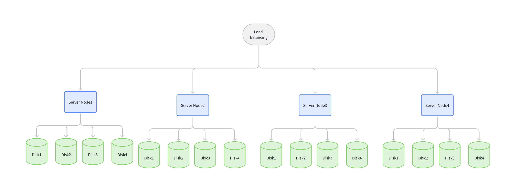

# 多机多盘（MNMD， Multiple Node Multiple Disk）

> 适用于生产环境中的关键业务，建议在专家指导下进行配置，并且了解并发、吞吐、业务场景、压力等多项指标，对系统进行全面优化。

最小需要 4 台服务器，最低每台服务器需要 1 块磁盘，才可以安全的启动分布式象存储集群。

以下架构图例，数据通过负载均衡，随机向任何一台服务器写入数据。以默认 12 + 4 的模式。 一个数据块默认会切分成 12 个数据块 + 4 个校验块，分别存到不同服务器的不同磁盘上。

任何 1 台服务器损坏或者维护都不会影响到数据安全。

任何 4 块磁盘以内的数据损坏都不会影响数据安全。

