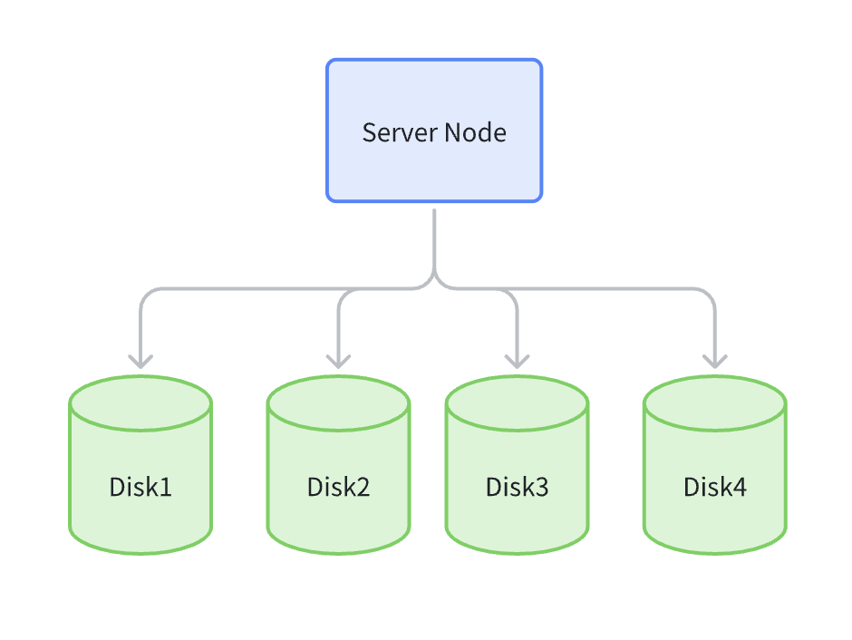

# 单机多盘模式(SNMD， Single Node Multiple Disk)

> 适用于中性非关键业务，在生产环境中通常损坏指定的 M 块硬盘不会出现数据风险，若整个服务器损坏或者超过 M 磁盘损坏，则数据丢失。

1 台服务器中只有多数据盘，数据以分片的形式存储在多个数据盘上。

一个数据块，会拆成指定的 K 个数据块和 M 个校验块，最多不能丢失 K 个数据块，最多不能丢失 M 个校验块。

以下图为例：

